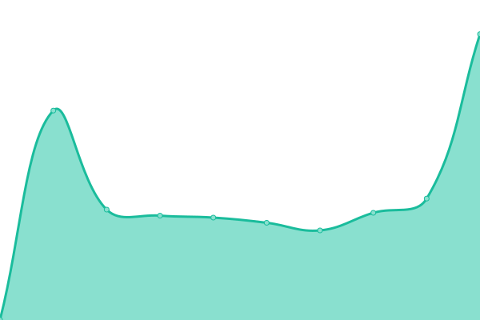
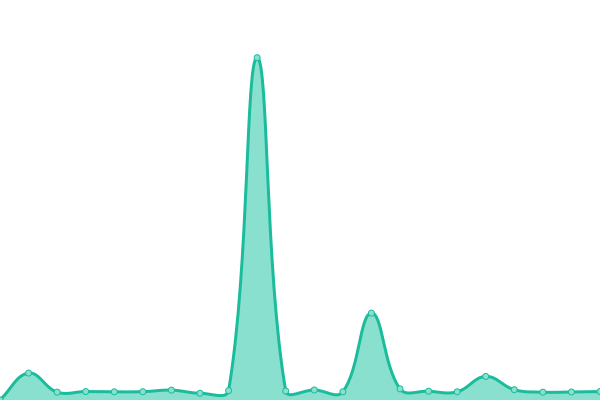

# [📈 Live Status](https://dennyxetiawan.github.io/uptime-ping): <!--live status--> **🟧 Partial outage**

This repository contains the open-source uptime monitor and status page for [dennyxetiawan](https://dennyxetiawan.github.io/uptime-ping), powered by [Upptime](https://github.com/upptime/upptime).

With [Upptime](https://upptime.js.org), you can get your own unlimited and free uptime monitor and status page, powered entirely by a GitHub repository. We use [Issues](https://github.com/dennyxetiawan/uptime-ping/issues) as incident reports, [Actions](https://github.com/dennyxetiawan/uptime-ping/actions) as uptime monitors, and [Pages](https://dennyxetiawan.github.io/uptime-ping) for the status page.

<!--start: status pages-->
<!-- This summary is generated by Upptime (https://github.com/upptime/upptime) -->
<!-- Do not edit this manually, your changes will be overwritten -->
<!-- prettier-ignore -->
| URL | Status | History | Response Time | Uptime |
| --- | ------ | ------- | ------------- | ------ |
|  [serverssh-idray](idray.serverip.my.id) | 🟩 Up | [serverssh-idray.yml](https://github.com/dennyxetiawan/uptime-ping/commits/HEAD/history/serverssh-idray.yml) | 

 966ms
     
 | 

<a href="https://dennyxetiawan.github.io/uptime-ping/history/serverssh-idray">99.84%</a>
    

|  [serverssh-sg1ray](sg1ray.serverip.my.id) | 🟩 Up | [serverssh-sg1ray.yml](https://github.com/dennyxetiawan/uptime-ping/commits/HEAD/history/serverssh-sg1ray.yml) | 

 1053ms
     
 | 

<a href="https://dennyxetiawan.github.io/uptime-ping/history/serverssh-sg1ray">99.72%</a>
    

|  [globalssh-wh-id](vless-wh-id01.globalssh.xyz) | 🟥 Down | [globalssh-wh-id.yml](https://github.com/dennyxetiawan/uptime-ping/commits/HEAD/history/globalssh-wh-id.yml) | 

 0ms
     
 | 

<a href="https://dennyxetiawan.github.io/uptime-ping/history/globalssh-wh-id">0.00%</a>
    

|  [globalssh-ikd-id](vless-ikd-id01.globalssh.xyz) | 🟥 Down | [globalssh-ikd-id.yml](https://github.com/dennyxetiawan/uptime-ping/commits/HEAD/history/globalssh-ikd-id.yml) | 

 0ms
     
 | 

<a href="https://dennyxetiawan.github.io/uptime-ping/history/globalssh-ikd-id">0.00%</a>
    

|  [globalssh-sg01](vmess-sg01.globalssh.xyz) | 🟥 Down | [globalssh-sg01.yml](https://github.com/dennyxetiawan/uptime-ping/commits/HEAD/history/globalssh-sg01.yml) | 

 0ms
     
 | 

<a href="https://dennyxetiawan.github.io/uptime-ping/history/globalssh-sg01">0.00%</a>
    

|  [ioh](http://myim3-he.ioh.co.id/api/v1/token/hetoken) | 🟥 Down | [ioh.yml](https://github.com/dennyxetiawan/uptime-ping/commits/HEAD/history/ioh.yml) | 

 0ms
     
 | 

<a href="https://dennyxetiawan.github.io/uptime-ping/history/ioh">0.00%</a>
    

<!--end: status pages-->

[**Visit our status website →**](https://dennyxetiawan.github.io/uptime-ping)

## 📄 License

- Powered by: [Upptime](https://github.com/upptime/upptime)
- Code: [MIT](./LICENSE) © [Anand Chowdhary](https://anandchowdhary.com), supported by [Pabio](https://pabio.com)
- Data in the `./history` directory: [Open Database License](https://opendatacommons.org/licenses/odbl/1-0/)
